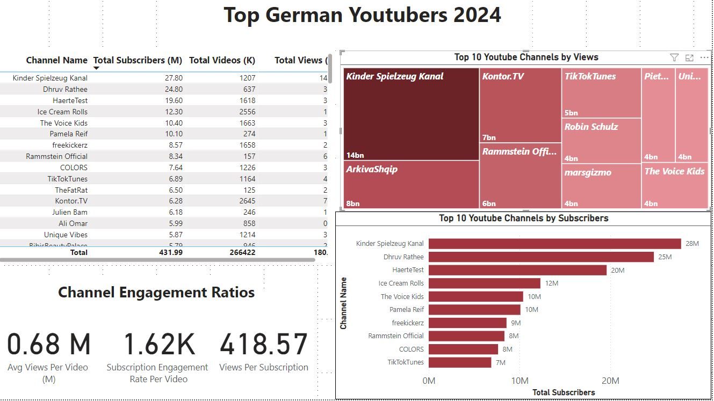
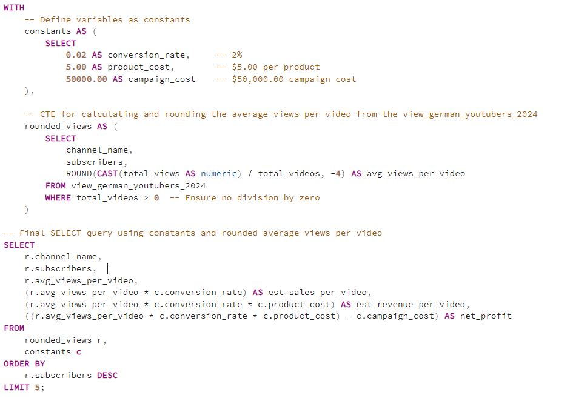

# YouTube Marketing Campaign Analysis

## Table of Contents

1. [Project Overview](#project-overview)
2. [Tools Used](#tools-used)
3. [Project Stages](#project-stages)
4. [Data Metrics](#data-metrics)
5. [Featured SQL Queries](#featured-sql-queries)
    - [Total Views in Billions](#total-views-in-billions)
    - [Average Views per Video](#average-views-per-video)
    - [Views per Subscription](#views-per-subscription)
    - [Subscription Engagement Rate per Video](#subscription-engagement-rate-per-video)
6. [DAX Measures in Power BI](#dax-measures-in-power-bi)
    - [Total Subscribers](#total-subscribers)
    - [Total Videos](#total-videos)
    - [Total Views](#total-views-numeric-for-sorting)
    - [Total Views](#total-views-display)
7. [PowerBI Dashboard](#powerbi-dashboard)
8. [Data Validation with SQL CTE and Excel Calculations](#data-validation-with-sql-cte-and-excel-calculations)
9. [Results](#results)
10. [Recommendations](#recommendations)
11. [Conclusion](#conclusion)

## Project Overview

This project simulates a marketing client struggling to run a few marketing campaigns. The objective is to recommend the best German YouTube channel for a successful marketing campaign based on various performance metrics.


## Tools Used

- **Excel**: For performing initial data analysis and calculations.
- **Power BI**: For visualizing data and creating interactive dashboards.
- **SQL**: For querying and analyzing data, and for data validation.
- **Python**: For advanced data processing and analysis. Specifically, a Python script was used with the `google-api-python-client` to fetch data from the YouTube Data API v3.
- **YouTube Data API**: For pulling data on YouTube channels, including the total number of subscribers, total views, and total videos.


### Project Stages

1. **Get Requirements**: Defined key objectives for recommending the best YouTube channel.
2. **Design the Dashboard**: Created a dashboard to visualize metrics for various YouTube channels.
3. **Collect Data**: Gathered data on German YouTube channels using the YouTube Data API, including subscribers, total videos, and views. This was achieved through a Python script utilizing the `google-api-python-client`.
4. **Explore Data**: Analyzed the dataset to understand the distribution of key metrics.
5. **Clean Data**: Ensured the data was accurate and consistent.
6. **Test Data**: Performed data quality checks to fix issues such as incorrect data types and duplicates.
7. **Visualize Data**: Created visuals to represent key metrics for each channel.
8. **Analyze Data**: Calculated key performance indicators (KPIs) to evaluate channels.
9. **Justify and Record Findings**: Provided recommendations based on the analysis.

## Data Metrics

- **Subscribers**: Total number of subscribers for each channel.
- **Total Videos**: Number of videos published by each channel.
- **Total Views (in Billions)**: Total views each channel has accumulated, formatted in billions.
- **Average Views per Video (Millions)**: Average number of views each video receives.
- **Subscription Engagement Rate per Video**: Average engagement rate per video.
- **Views per Subscription**: Average number of views per subscriber.

## Featured SQL Queries

Below are some featured SQL queries used to analyze the data:

### Total Views in Billions

```sql
SELECT 
    channel_name,
    SUM(total_views) / 1000000000 AS Total_Views_Billions
FROM 
    view_german_youtubers_2024
GROUP BY 
    channel_name;
```

### Average Views per Video

```sql
SELECT 
    channel_name,
    SUM(total_views) / COUNT(total_videos) AS Average_Views_Per_Video
FROM 
    view_german_youtubers_2024
GROUP BY 
    channel_name;
```


### Views per Subscription

```sql
SELECT 
    channel_name,
    SUM(total_views) / SUM(subscribers) AS Views_Per_Subscription
FROM 
    view_german_youtubers_2024
GROUP BY 
    channel_name;
```


### Subscription Engagement Rate per Video

```sql
SELECT 
    channel_name,
    (SUM(total_views) / COUNT(total_videos)) AS Subscription_Engagement_Rate_Per_Video
FROM 
    view_german_youtubers_2024
GROUP BY 
    channel_name;
```


## DAX Measures in Power BI

In addition to SQL queries, DAX (Data Analysis Expressions) was used in Power BI to create measures for data analysis and visualization. Here are some of the key DAX measures:

### Total Subscribers

```DAX
Total Subscribers Numeric = 
SUM('view_german_youtubers_2024'[subscribers])

```


### Total Videos

```DAX
Total Videos = 
VAR TotalVideos = SUM('view_german_youtubers_2024'[total_videos])
VAR TotalVideosInThousands = TotalVideos / 1000
RETURN
    TotalVideosInThousands

```


### Total Views

```DAX
Total Views = 
VAR TotalViews = SUM('view_german_youtubers_2024'[total_views])
VAR TotalViewsInBillions = TotalViews / 1000000000
RETURN
    TotalViewsInBillions

```

## PowerBI Dashboard



## Data Validation with SQL CTE and Excel Calculations

For validating our data and comparing results with the Excel calculations, the following SQL Common Table Expression (CTE) is used for validating data and comparing results with the Excel calculations. Here’s a detailed breakdown of what this CTE does and the insights you can extract from it:



### Metrics Calculated
- Estimated Sales per Video: Estimated number of sales per video based on average views and conversion rate.
- Estimated Revenue per Video: Estimated revenue per video, calculated by multiplying estimated sales per video by the product cost.
- Net Profit: Calculates the net profit per video by subtracting the campaign cost from the estimated revenue per video.

### Insights Extracted
- Average Views per Video: Understand the typical engagement level of each video. Higher average indicates better viewer engagement.
- Estimated Sales per Video: Estimate how many sales each video could potentially generate, providing insight into sales potential.
- Estimated Revenue per Video: Shows the potential revenue generated from each video, helping assess revenue potential.
- Net Profit: Determines the profitability of running a marketing campaign on each channel.
- Channel Ranking: Orders channels by the number of subscribers, offering a quick view of the top channels based on their subscriber base.

By comparing these calculated metrics with those obtained from Excel calculations, We could validate the data, ensure consistency, and make informed decisions about which YouTube channels to prioritize for marketing campaigns.

## Results

Here are the results for the German YouTube channels analyzed:

| Channel Name         | Subscribers | Total Videos | Total Views (Billions) | Average Views per Video (Millions) | Subscription Engagement Rate per Video | Views per Subscription |
|----------------------|-------------|--------------|-------------------------|------------------------------------|----------------------------------------|------------------------|
| Kinder Spielzeug Kanal | 27,800,000   | 1,207        | 14.36                   | 11.90                              | 23.03 K                                | 516.69                 |
| Dhruv Rathee         | 24,800,000   | 637          | 3.29                    | 5.17                               | 38.93 K                                | 132.74                 |
| HaerteTest           | 19,600,000   | 1,618        | 3.39                    | 2.09                               | 12.11 K                                | 172.94                 |
| Ice Cream Rolls      | 12,300,000   | 2,556        | 1.69                    | 0.66                               | 4.81 K                                 | 137.13                 |
| The Voice Kids       | 10,400,000   | 1,663        | 3.52                    | 2.12                               | 6.25 K                                 | 338.65                 |

## Recommendations

Based on the analysis, the following recommendations were made:

- **Best Overall Channel**: **Kinder Spielzeug Kanal**
  - **Strengths**: Highest total views, highest average views per video, and highest views per subscription. Ideal for broad marketing campaigns due to its extensive reach.

- **Best Channel for Engagement**: **Dhruv Rathee**
  - **Strengths**: Highest subscription engagement rate per video, indicating high interaction levels. Suitable for campaigns targeting an engaged audience.

- **Best for Content Volume**: **Ice Cream Rolls**
  - **Strengths**: Largest number of total videos, providing frequent content exposure. Useful for campaigns requiring high content volume.

- **Best Balance of Metrics**: **The Voice Kids**
  - **Strengths**: Good views per subscription and average views per video, providing a balanced mix of reach and engagement.

## Conclusion

**Kinder Spielzeug Kanal** is recommended as the best choice for a marketing campaign due to its high reach and impact. **Dhruv Rathee** is recommended for campaigns focusing on engagement, while **Ice Cream Rolls** is ideal for content volume. **The Voice Kids** offers a balanced mix of reach and engagement.

For any further analysis or to customize the recommendation based on specific needs, additional data and metrics can be considered.

---

